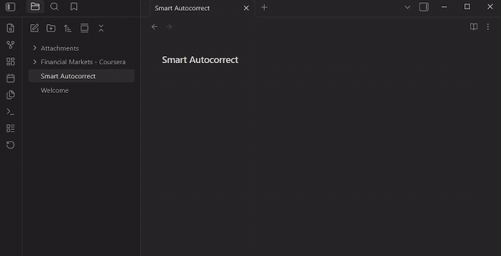
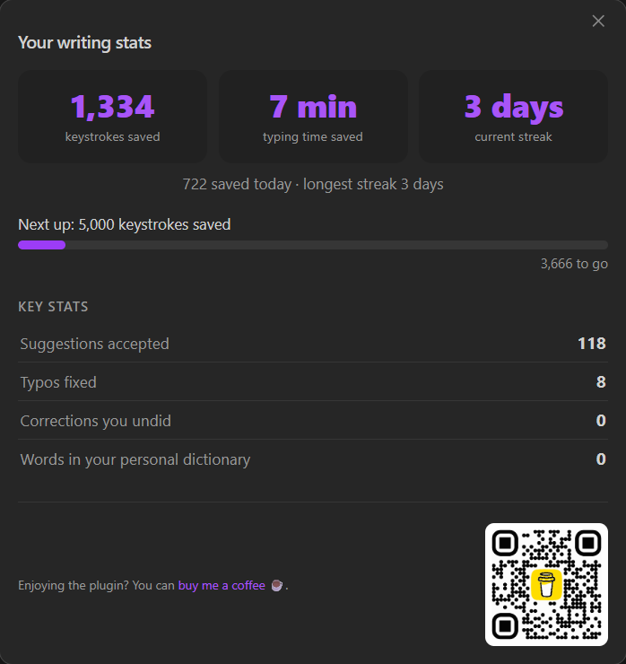

# ✍️ Smart Autocorrect for Obsidian

**Phone-style autocorrect and next-word prediction, right inside your vault.**

It runs completely offline, so your notes stay private and never leave your device.

 &nbsp;·&nbsp; 

  

## ⚡ As you type

- **Real-time autocorrect.** Typos are fixed automatically as you write.
- **Next-word and phrase completion.** A popup predicts what comes next. Press `Tab` to accept.
- **Contextual suggestions.** It reads the sentence you're writing and your other notes.
- **100% local.** Everything runs on-device. No cloud, no telemetry, no account.

## ✨ Additional features

- **Suggest alternatives.** Right-click any word for more eloquent wording (good becomes *substantial*, help becomes *facilitate*, big becomes *immense*).
- **Smart capitalisation.** Sentence starts, names and places, and abbreviations like `e.g.` and `U.S.` are handled for you.
- **Learns your writing.** Words from your own notes come up first. Made a wrong correction? Just undo with `Ctrl/Cmd+Z`: it restores your text, remembers the word, and stops correcting it.
- **Note links** *(experimental)*. Text that matches one of your notes gets underlined; hover to preview, click to link.
- **Writing stats.** See keystrokes saved, typing time saved, and your daily streak.

  

## 🚀 Getting started

1. Install and enable the plugin.
2. Accept the one-time model download (86 MB) when prompted.
3. Start typing. There's nothing to configure; everything in settings is optional.

## 🔒 Privacy

100% local, with no telemetry and no cloud. The only network request is the one-time model download, which you can decline. Anything the plugin learns lives in `personalization.json` inside the plugin folder, so it travels with your vault and never touches your notes.

Prediction and capitalisation are English-only. The personal dictionary works in any language.

## ☕ Support

If this saves you time, you can [buy me a coffee](https://buymeacoffee.com/zangeti).

## Credits

Started as a fork of [Various Complements](https://github.com/tadashi-aikawa/obsidian-various-complements-plugin) by Tadashi Aikawa, since rewritten around a local neural language model. MIT licensed.
